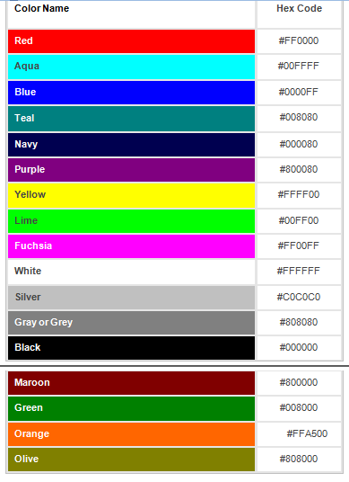

# Head-First-HTML-CSS

This is my learning-record and codes.

## Note

**ch.03**  
1.block elements: < p >, < h1 > ~ < h6 >, < blockquote >, < ol >, < ul >, < dl >, < li >, < div >  
  inline elements: < a >, < em >, < strong >, < q >, < span >  
  void elements: < br >, < img >, < link >  

**ch.05**  
1. How to choose image format:  
  lots of colors: JPEG or PNG;  
  lots of continuous colors: JPEG;  
  simple logo and icon with slightly geometric: PNG or GIF;  
  transparency: PNG, GIF(limited);  

**ch.06 industry standard HTML**  
1. HTML5 doctype: <!doctype html>  
2. Adding a meta tag to specify the character encoding (after HTML5): **< meta charset="utf-8" >**  
3. W3C validator: http://validator.w3.org  

**ch.07 CSS**  
1. How to use external stylesheet to add CSS-Style:  
  **< link type="text/css" rel="stylesheet" href="???.css" >**  
  **p.s. External Stylesheet makes it easier if you want to do some adjustments for style.**  
2. Specificity grade of CSS (bottom is specificer than upper):  
  **body { }**  
  **other_element { }**  
  **.class { }**  
  **other_element.class { }**  
3. By equal specificity the last CSS wins.  
4. We can make an element belonged to many classes, like this:  
  **< p class="tea cafe cocktails" >**  
  But only the the class selector in ???.css works.(NOT means the last classname in < p > element of ???.html)  
5. W3C CSS validator: http://jigsaw.w3.org/css-validator  

**ch.08 CSS: font & colors**  
1. Customize the fonts with font-family property:  
  example: **body { font-family: Verdana, Geneva, Arial, sans-serif; }**  
  explain: **element { font-family: "alternative font A", "alternative font B", "alternative font C", "fontfamilyname"}**  
  There are 5 font families: **sans-serif**, **serif**, **monospace**, **cursive** and **fantasy**.  
2. Using **@font-face** to load the fonts:  
  .woff is a font format, which is accepted for most modern browsers.  
  **example:**  
    **@font-face {**  
       **font-family: "fontname";**  
       **src: url("http://wickedlysmart.com/hfhtmlcss/chapter8/journal/EmblemaOne-Regular.woff");**  
    **}**  
  explain:  
    a. @font-face is NOT a ordinary CSS selector rule, it's kind of special rule and should be wrote above the body selector rule;  
    b. use { font-family: "fontname"; } to give this font-family a name;  
    c. src can use full url on Internet or from local data.  
3. Fontsize:  
  absolute: **{ font-size: ??px; }**  
  relative to inherited size: **{ font-size: ??%; }** or **{ font-size: ??em; }**  
  keywords: **{ font-size: small; }**  
  **p.s. Relative-Size makes it easier than all in pixels if you want to do some adjustments for font size.**  
4. Default sizes of font:  
  default font-size: 16px;  
  < h1 >: 200% of default font-size;  
  < h2 >: 150% of default font-size;  
  < h3 >: 120% of default font-size;  
  < h4 >: 100% of default font-size;  
  **p.s. If you don't use absolute but relative font-size in body CSS selector, then it will be relative to the default value.**  
5. CSS color:  
    
  more reference: https://en.wikipedia.org/wiki/Web_colors  
6. Ways to specify web colors:  
  a. **By color name**: the obove 16 colors (without "Orange") can be used in all browsers, in modern browser 150 more extendes colors can be specified by name;  
  example: **{ color: lightseagreen; }**  
  b. **By rgb percents**:  
  example: **{ color: rgb(13%, 70%, 67%); }**  
  **p.s. actually is 12.5%, 69.8%, 66.7%, but in many browsers only integer number is accepted, so this is not a good way for some colors**  
  c. **By rgb in decimal values**  
  example: **{ color: (32, 178, 170); }**  
  **p.s. We use 8 digits binary number to represent a color-value, 2^8=256, so we use 0~255 in decimal system**  
  d. **By rgb in hexadecimal values ("Hex-Code")**  
  example: **{ color: #20B2AA }**  
  **p.s. for 0~255 color-values we use 2 digits hexadecimal number, because 16^2=256**  

**ch.09 CSS: Box Model**  
1. Box Model:  
    
2. Rules for class and id names:  
  Class names should begin with a letter, but id names can start with a number or a letter. Both id and class names can contain **letters**, **numbers** and "**_**", but **no spaces**.  
  example: “number1” **OK**, “main_content” **OK**, “header content” **No**  
3. Using multiple stylesheets:  
  a. The order of the stylesheets matters, if you use several stylesheets. The < link > elements with stylesheets go from top to bottom in HTML, with the stylesheets **on the bottom** taking precedence.  
  b. You can add **media** attribute to the < link > element to pick up suitable style files for different devices.  

**ch.10 div & span**  
1. < div > and < span > are all uesed for mark **logical sections**, < div > is block-element, < span > is inline-element.  
2. Descendant selectors in CSS:  
  a. **parent element by element name**  
  example: **div h2 { color: black; }**  
  b. **parent element by id**  
  example: **#elixirs h2 { color: black; }** with **< div id="elixirs" >** in HTML  
3. Select a direct child in CSS:  
  example: you could use “**#elixirs > h2**” to select < h2 > **only if it is the direct child** of an element with an id of “elixirs”  
4. Shortcut for some CSSs:  
  a. padding & margin:  
    
  b. border:  
    
  c. background:  
    
  d. font: be omitted  
5. Calculate the specificity in Cascading Style Sheets:  
    
  sort conflicting rules after their specifity and appears the style with the biggest number.  
6. **Text-align** is a property for block elements that aligns all inline content in the block element, to the center, left or right. It is inherited by any nested block elements.  

**ch.11 Layout**  
1. **Liquid Layout**, **Fronzen Layout** and **Jello Layout**  
  Liquid Layout: for main content **{ width: ??px; }**, for float content **{ float: left/right; }**, for footer **{ clear: right/left; }**  
  Fronzen Layout: for allcontent **{ width: ???px; padding-top: ??px; padding-bottom: ??px; }**  
  Jello Layout: for allcontent **{ margin-left: auto; margin-right: auto; }**  
2. Absolute Positioning  
  **{ position: absolute; ... }**  
  p.s.: The default value of position is **static**. With static positioning, the element is placed in the normal document flow. Actually there are four position property values: static, absolute, fixed, and relative.  
3. Use CSS to display table  
  **{ display: table; }**  
  **{ display: table-row; }**  
  **{ display: table-cell; }**  
  

